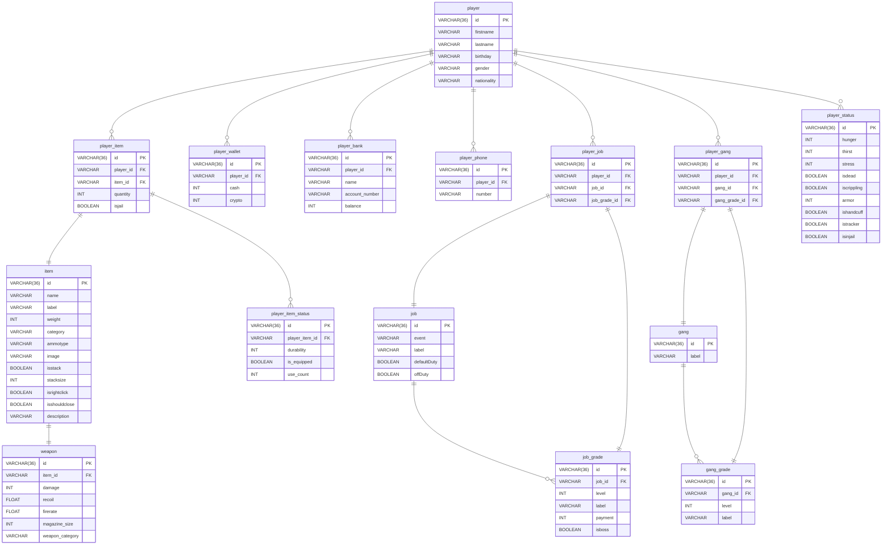

# DGCore Framework

Document: 今後追加します……

**DGCore**は、FiveMのGTA5向けに設計された柔軟性を重視したLuaベースのロールプレイフレームワークです
QBCoreを参考にコードを最初から作り直しています
また、このフレームワークは日本語でプレイできるように調整しています
今のところ英語など多言語の対応は予定していません

## 注意
- 現在、開発初期のため機能が未実装です。
- 本フレームワークは開発中です。今後のアップデートで使用が変更する可能性があります。

## 機能一覧
- ユーザー管理（名前・誕生日・国籍など）
- ジョブ・ギャング（階級・権限など）（簡単な編集機能など）
- アイテム・インベントリシステム（耐久度・装備状態・使用回数管理など）
- 所持金・銀行システム
- 電話機能
- プレイヤーステータス管理（空腹・喉の渇き・ストレス・拘束・刑務所など）

## セットアップ方法
### 必要条件
- FiveMサーバー（最新推奨）
- MySQLサーバー
- `oxmysql`
### インストール
```bash
git clone https://github.com/DOGON309/dg-core.git
```
### データベースのセットアップ
上から順番にしてください（テーブルを作成してからでないとエラーが発生します……）
```bash
mysql -u <yourname> -p < dg-core/sql/dgcore.sql
```
```bash
mysql -u <yourname> -p < dg-core/sql/item_insert.sql
```
```bash
mysql -u <yourname> -p < dg-core/sql/gang_insert.sql
```
```bash
mysql -u <yourname> -p < dg-core/sql/job_insert.sql
```
### 設定カスタマイズ
```dg-core/config.lua```を変更してください（大体、QBCoreに沿っています)

## ディレクトリ構成
```bash
dgcore/
│
├── client/             # クライアント側スクリプト
├── lib/                # 共通定数やユーティリティ
├── model/              # モデル
├── server/             # サーバー側ロジック
├── sql/                # SQLスキーマと初期データ
├── ui/                 # UI
├── config.lua          # 設定ファイル
└── README.md
```
## データベース設計
全てのデータをデータベースで管理することで階級の編集やギャングの追加など簡単に行えるようにしています
[!WARNING]
これは実験的な挑戦です。処理に耐えらるかどうかを検証する必要があります。

- `player`: プレイヤーの基本情報
- `player_status`: プレイヤーのステータス
- `player_item`: 所持アイテム
- `player_item_status`: 所持しているアイテムのステータス
- `player_wallet`: 現金の管理
- `player_bank`: 銀行の管理
- `player_phone`: 電話番号一覧
- `player_job`: 仕事一覧

- `item`: アイテムの定義

- `weapon`: 武器の定義

- `job`: 仕事の定義
- `job_grade`: 仕事の階級

- `gang`: ギャングの定義
- `gang_grade`: ギャングの階級



## 📜 ライセンス

GNU General Public License v3.0

このプロジェクトは [GPL-3.0](https://www.gnu.org/licenses/gpl-3.0.html) の下でライセンスされています。  
本フレームワークの改変・再配布・利用に際しては、ソースコードの公開およびライセンスの継承が必要です。

---

© 2025 DGCore開発チーム – Licensed under the GNU GPLv3

## 📄 ライセンスに関する注意

DGCoreの一部のアセット（例：アイテム画像や定義データなど）は、QBCoreプロジェクト（GPL-3.0）の一部を流用しています。  
そのため、本プロジェクト全体は **GNU GPL v3.0** の下でライセンスされています。

## 🔗 他プロジェクトからの引用

以下のファイル・データはQBCoreより引用・加工されています：

- `ui/images/*.png`（アイテム画像）
- `sql/items.sql` の一部（アイテム定義）
- `sql/job.sql`の一部（仕事の構成・階級）
- `sql/gang.sql`の一部（ギャングの構成・階級）
- `config.lua`設定項目

引用元: https://github.com/qbcore-framework
